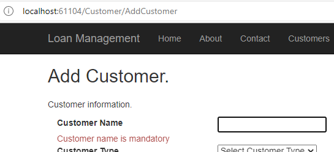

Client side validation
<details>
<summary>View</summary>
	
```csharp
	
	@using (Html.BeginForm(actionName: "AddCustomer", controllerName: "Home", method: FormMethod.Post))
	    {
		<div class="row">
		    <div class="col-lg-2">
			@Html.LabelFor(m => m.customer.CustomerName)
		    </div>
		    <div class="col-lg-2">
			@Html.TextBoxFor(m => m.customer.CustomerName, "", new { id = "CustomerName" })
		    </div>
		</div>
		<div class="row">
		    <div class="col-lg-4">
			@Html.ValidationMessageFor(m => m.customer.CustomerName, "", new { @class = "text-danger" })
		    </div>
		</div>
		(...)
	    }
	
```
</detail>
	
<picture>
 <source media="(prefers-color-scheme: dark)" srcset="YOUR-DARKMODE-IMAGE">
 <source media="(prefers-color-scheme: light)" srcset="YOUR-LIGHTMODE-IMAGE">
 
</picture>
